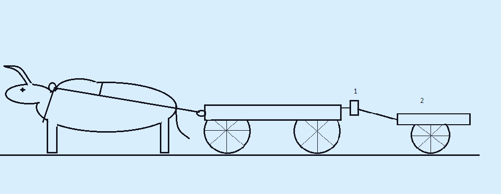

# Resilience-B.-
Mobile animal-powered mechanical generator hub for humanitarian aid, WASH, and community resilience in off-grid regions.
markdown
[resilience-b.-layout](schema_2.png)

    <em>Figure 1: Core mechanical layout of the Resilience-B mobile energy system.</em> 
 
# Resilience-B: Animal-Powered Mobile Energy Hub A technical concept for an electromechanical generation system utilizing the draft power of Afrikaner oxen to supply electricity to off-grid communities and humanitarian missions. --- ## 1. Technical Specifications (Mobile Hub) * **Generation Type:** Electromechanical drive from the wheel axle (motorcycle component standard). * **Transmission:** Two-stage chain drive with a ratio of `1:12 – 1:14`. * **Peak Output:** 500–600 W (operated by a pair of oxen). * **Storage:** LiFePO4 48V 50Ah–100Ah (`2.4 – 4.8 kWh`). * **Module Mass:** 120–150 kg (acts as a ballast load to ensure ground traction). --- ## 2. Power Calculations & Community Distribution A pair of Afrikaner oxen, working without overload, can fully charge a **48V 100Ah (4.8 kWh)** battery bank in a single daylight shift. ### Daily Energy Budget Allocation: 1. **Medical (Priority 1):** Vaccine refrigerator cold chain (24/7 support) — **1.2 kWh/day**. 2. **Water Supply (WASH):** 48V submersible pump (30m lift). 2 hours of operation — **0.6 kWh** (~3,000–4,000 liters of water extracted). 3. **Communication & Lighting:** Charging 50 smartphones via USB hubs + evening LED lighting for the community center — **0.5 kWh**. 4. **Food Security:** Rotary cutter/mower (300W) for 30 mins — **0.15 kWh** (daily fodder harvesting). 5. **Reserve:** **0.55 kWh** for emergency needs (night security lighting, power tools). * **Equipment Standardization:** All standard tools (except the pump and mower) can run on standard AC grid power (220V) by integrating a high-quality `48V -> 220V` inverter into the hub. --- ## 3. Optimization: Single Energy Trailer Configuration Removing the heavy 300 kg utility cart and using only the autonomous **120-150 kg energy trailer** drastically shifts system efficiency: * **Output Power:** With the same draft effort from the oxen (120–150 kgf), the charging controller can stabilize at **~900–1000 W** due to reduced rolling resistance. * **Shift Output:** Yields **6.0 kWh** over a 6-hour shift. * **Charging Speed:** Reduces full charge time for a 48V 100Ah battery to **4.5–5 hours** instead of 6. * **Traction & Ground Grip Risk:** At 150 kg, 1000 W of electrical resistance might cause wheels to skid. * **Engineering Solution:** Install a driver's seat directly above the generator axle. The operator's weight (70–80 kg) provides optimal downforce without adding dead weight to the structure itself. --- ## 4. Soft Start System & Animal Protection ("Humane Engineering") To prevent joint injuries and stress to the animal, the generator must not engage abruptly. ### The "20-Second" Microcontroller Logic (Arduino "Black Box"): 1. **Motion Detection:** The system registers wheel rotation via a Hall effect sensor. 2. **Delay Phase (0–5 sec):** Generation is completely off. The oxen easily overcome static inertia and reach cruising speed. 3. **Ramping Phase (5–20 sec):** The controller uses Pulse Width Modulation (PWM) to smoothly scale up current draw from `0` to the nominal `5–6 A`. 4. **Result:** Resistance increases imperceptibly. The animal does not get spooked or break its steady gait. ### Field Repairs & Low-Tech Alternatives (Red Cross standard): * **Circuit Breaker Block:** Instead of microelectronics, a block of 4 standard domestic AC circuit breakers (10-16A) can be used. The operator manually flips them every 5 seconds (+50W per switch) as the cart accelerates. * **Water-Cooled Ballast (R):** Excess energy during startup shifts is dumped into nichrome wire coils submerged in a 1-liter container of rainwater. Water prevents the wire from overheating above 100°C, averting oxidation. --- ## 5. Humanitarian Sector Benefits & Bio-Loop * **Fuel Independence:** Zero operational costs. Powered purely by local biomass (grass). * **Survivability:** Built on motorcycle parts. Any village workshop can repair the mechanics. * **Bio-Loop Security:** A fully closed cycle independent of external resources: $$\text{Ox eats grass} \rightarrow \text{Generates energy} \rightarrow \text{Power runs mower} \rightarrow \text{Mower cuts grass for ox}$$ * **Emergency Response Module:** Upon arriving at a disaster site, rescuers instantly receive high-power LED lighting, angle grinders for cutting rebar, and drills for assembling shelters—without using a single drop of fuel. 
markdown

# Resilience-B: Hub Énergétique Mobile à Traction Animale Concept technique d'un système de génération électromécanique utilisant la force de traction des bœufs Afrikaner pour alimenter les communautés isolées et les missions humanitaires. --- ## 1. Caractéristiques Techniques (Mobile Hub) * **Type de génération:** Entraînement électromécanique depuis l'essieu des roues (standard moto). * **Transmission:** Chaîne à deux étages avec un rapport de `1:12 – 1:14`. * **Production de pointe:** 500–600 W (avec une paire de bœufs). * **Stockage:** LiFePO4 48V 50Ah–100Ah (`2.4 – 4.8 kWh`). * **Masse du module:** 120–150 kg (charge de lestage pour assurer l'adhérence au sol). --- ## 2. Calcul de Puissance et Besoins Communautaires Une paire de bœufs Afrikaner, travaillant sans surcharge, recharge complètement une batterie **48V 100Ah (4.8 kWh)** en une seule journée de marche. ### Répartition quotidienne de l'énergie (Cycle Villageois): 1. **Santé (Priorité 1):** Chaîne du froid pour les vaccins (réfrigérateur médical 24/7) — **1.2 kWh/jour**. 2. **Eau (WASH):** Pompe immergée 48V (hauteur de levage 30m). 2 heures de fonctionnement — **0.6 kWh** (pompage de ~3000–4000 litres d'eau). 3. **Communication & Éclairage:** Recharge de 50 smartphones (via hubs USB) + éclairage LED du centre public le soir — **0.5 kWh**. 4. **Sécurité Alimentaire:** Faucheuse rotative (300W) pendant 30 min — **0.15 kWh** (récolte quotidienne de fourrage). 5. **Réserve:** **0.55 kWh** pour les urgences (éclairage nocturne, outils électriques). --- ## 3. Optimisation: Configuration « Remorque Énergétique Seule » Si l'on retire la charrette lourde de 300 kg pour ne laisser que la remorque autonome de **120–150 kg**, l'efficacité augmente radicalement: * **Puissance de sortie:** Pour le même effort des bœufs (120–150 kgf), le contrôleur reçoit **~900–1000 W** grâce à la réduction de la résistance au roulement. * **Production par cycle:** **6.0 kWh** pour 6 heures de marche. * **Vitesse de charge:** Charge complète en **4.5–5 heures** au lieu de 6. * **Solution d'adhérence (Traction):** Pour éviter le patinage des roues légère à 1000W, un siège pour le conducteur est installé directement au-dessus de l'essieu. Le poids humain (70–80 kg) assure une pression idéale au sol sans alourdir la structure métallique. --- ## 4. Système de Démarrage Progressif (Soft Start) et Protection Animale Pour protéger les articulations de l'animal, la charge du générateur ne doit pas s'enclencher brusquement. ### Logique de la « Boîte Noire » (Microcontrôleur Arduino): 1. **Détection du mouvement:** Capteur à effet Hall sur la roue. 2. **Phase de pause (0–5 sec):** Génération coupée. Les bœufs surmontent l'inertie de démarrage et atteignent leur vitesse de croisière. 3. **Phase de rampe (5–20 sec):** Le contrôleur (via PWM) augmente progressivement l'intensité de `0` à `5–6 A`. 4. **Résultat:** La résistance augmente de manière invisible, sans effrayer l'animal. ### Alternative Low-Tech pour les conditions extrêmes (Standard Croix-Rouge): * **Bloc de disjoncteurs domestiques:** Remplacement de l'électronique par 4 disjoncteurs AC standards (10-16A). Le conducteur les enclenche manuellement toutes les 5 secondes (+50W par interrupteur). * **Lest liquide refroidi par eau:** L'excès d'énergie est dissipé dans des résistances en nichrome immergées dans 1 litre d'eau de pluie. L'eau maintient le fil sous les 100°C, évitant l'oxydation. --- ## 5. Avantages Humanitaires et Cycle Fermé (Bio-Loop) * **Indépendance énergétique:** Coût d'exploitation nul. Alimenté uniquement par la biomasse locale (herbe). * **Robustesse:** Conçu avec des pièces de moto. N'importe quel atelier de village peut réparer la mécanique. * **Cycle Fermé (Bio-Loop):** Un système totalement autonome: $$\text{Le bœuf mange de l'herbe} \rightarrow \text{Produit de l'énergie} \rightarrow \text{L'énergie alimente la faucheuse} \rightarrow \text{La faucheuse coupe l'herbe}$$ * **Module d'intervention d'urgence:** En arrivant sur un site de catastrophe, les secours disposent instantanément de projecteurs LED, de meuleuses pour couper le métal et de perceuses pour monter des abris — sans utiliser une seule goutte de carburant. 
ENGLISH VERSION

markdown

## 10. HEAVY DUTY CONFIGURATION: "Resilience-Heavy" (Truck Edition) For large-scale community operations requiring a team of 4 to 6 oxen, the system is constructed by upcycling a decommissioned rear-wheel-drive vehicle (e.g., an old body-on-frame pickup truck or station wagon). This deployment fully eliminates the need for fabricating custom frames or complex custom speed-reducers by utilizing existing automotive components (Upcycling). ### 10.1. Mechanical Integration and Powertrain * **Chassis and Operator Comfort:** The vehicle cabin, chassis, and braking system remain fully intact. The driver/operator sits safely inside the weather-proof cabin. Utilizing the original automotive hydraulic brakes allows the operator to have full control of the cart on descents, completely relieving and protecting the oxen's necks from the heavy backing load of the vehicle. * **Automotive Axle as a Multiplier:** The draft force from the 4–6 oxen rotates the rear wheels. The rear differential and the driveshaft (propeller shaft) operate in an inverse (reverse power-flow) mode, acting as a heavy-duty mechanical step-up gearbox. * **Gearbox Control:** The driveshaft transfers rotation directly to the stock manual transmission. By shifting gears from inside the cabin, the operator can dynamically change the gear ratio, fine-tuning the generator's RPM to fit the current walking speed of the oxen and road terrain. * **Hub-Motor Integration:** A high-power geared hub-motor is securely coupled directly to the output shaft of the gearbox (occupying the space where the vehicle's engine block used to sit). ### 10.2. Mechanical Multiplier Calculations (RPM Engineering) To convert the slow walk of oxen into the high rotational speed required for efficient generation, the automotive transmission executes a three-stage shaft acceleration: 1. **Oxen Walking Speed:** At a cruising ox speed of $1.0 \text{ m/s}$ ($3.6 \text{ km/h}$) on standard automotive R14/R15 wheels, the driving axle rotates at **$30 \text{ RPM}$**. 2. **Rear Differential (First Stage):** The ring-and-pinion gear pair of the axle (averaging a ratio of `4.1:1`) spins the driveshaft up to **$123 \text{ RPM}$**. 3. **Gearbox Utilization (Second Stage):** For maximum multiplication efficiency, the **Reverse Gear** (typically a ratio of `~3.5:1`) is engaged. In reverse power-flow, it operates as a powerful multiplier, driving the transmission output shaft up to **$430 \text{ RPM}$**. ### 10.3. Geared Hub-Motor Hybrid Integration (Third Stage & Efficiency) Direct use of standard hub-motors at low axle speeds (30 RPM) is impossible due to efficiency dropping to near-zero and a complete lack of charging current (the counter-EMF voltage will not exceed 5V). Coupling a geared motor with a manual transmission solves this issue: * **Internal Planetary Reducer:** A quality 1000W geared hub-motor contains a built-in planetary gear set (typically a ratio of `1:5`). * **Final Rotor Speed:** When the gearbox rotates the hub-motor housing at $430 \text{ RPM}$, the internal planetary gears multiply this speed 5 times over, accelerating the internal permanent magnet rotor to **$\sim 2150 \text{ RPM}$**. * **Electrical Efficiency:** At speeds exceeding 2000 RPM, the brushless motor easily generates over **50 Volts**, successfully overcoming the resistance of the 48V LiFePO4 battery bank. Power generation efficiency peaks at **75–80%** without overheating the copper windings. ### 10.4. Active Assist Traction (Reverse Gear Assist Mode) When the system switches into active helper (assist) mode for starting or climbing a steep hill, the energy flow reverses: current flows from the LiFePO4 battery bank *into* the hub-motor. * Due to the massive cumulative gear reduction of the transmission (approximately `14:1`), the 1000W motor delivers up to **$75\text{--}76 \text{ kgf}$ of continuous driving force** at the wheels. * This force is enough to autonomously push a 1.5-ton chassis forward, fully removing critical strain from the animals during dead-stop starts and harsh uphill climbs. ### 10.5. Automotive Clutch Integration The vehicle's original clutch pedal and pressure plate mechanism remain fully functional and are controlled by the operator inside the cabin. This provides two essential functions: * **Mechanical Kill-Switch (Safety):** In the event of any electronic failure, short circuit, or motor lockup, the driver simply depresses the clutch pedal. The physical link between the generator and the wheels is broken instantly, protecting the oxen from dangerous jerks or sudden loads. * **Smoother Launching:** The oxen can start moving with the clutch pedal fully depressed (zero resistance from the drivetrain). Once the cart gains rolling momentum, the operator slowly releases the pedal, smoothly engaging the generator load. ### 10.6. Active Steering Mechanism The automotive steering system (steering rack or steering gearbox) is fully retained for driving the vehicle from the cabin. * **Animal Joint Protection:** In a heavy 4-to-6 ox configuration, sharp turns put a massive, potentially injuring lateral stress on the leading animals' necks. By actively turning the steering wheel from inside the cabin, the operator aligns the front wheels with the turn. The 1.5-ton chassis smoothly pivots into the corner, protecting the oxen's joints from dislocations and strain. * **Low-Tech Adaptation:** The power steering pump (PAS) is completely removed from the system. For this technical requirement, donor vehicles with manual steering racks are highly recommended (or fully drained hydraulic systems converted to manual mode) so that the steering wheel can be easily turned by human hands without an active engine pump. 

🇫🇷 FRANÇAIS VERSION

markdown

## 10. CONFIGURATION LOURDE : "Resilience-Heavy" (Truck Edition) Pour les opérations communautaires à grande échelle nécessitant un attelage de 4 à 6 bœufs, le système est construit en recyclant un véhicule hors d'usage à propulsion arrière (par exemple, un vieux pick-up à châssis indépendant ou un break). Cette configuration élimine complètement la nécessité de fabriquer des châssis sur mesure ou des réducteurs complexes en réutilisant directement des composants automobiles existants (Upcycling). ### 10.1. Intégration Mécanique et Transmission * **Châssis et Confort de l'Opérateur :** La cabine du véhicule, le châssis et le système de freinage restent entièrement intacts. Le conducteur/opérateur est assis en sécurité à l'intérieur de la cabine étanche. L'utilisation des freins hydrauliques automobiles d'origine permet à l'opérateur de contrôler parfaitement la charrette dans les descentes, soulageant et protégeant ainsi le cou des bœufs de la charge de retenue du véhicule. * **Essieu Automobile comme Multiplicateur :** La force de traction des 4 à 6 bœufs fait tourner les roues arrière. Le différentiel arrière et l'arbre de transmission (cardan) fonctionnent en mode inversé (flux de puissance inversé), agissant comme un multiplicateur de régime mécanique robuste. * **Régulation par Boîte de Vitesses :** L'arbre de transmission transmet la rotation directement à la boîte de vitesses manuelle d'origine. En changeant manuellement les rapports depuis la cabine, l'opérateur peut ajuster dynamiquement le rapport de transmission, adaptant le régime RPM du générateur à la vitesse de marche des bœufs et au relief de la piste. * **Intégration du Moteur-Roue :** Un moteur-roue électrique à réducteur de haute puissance est couplé directement à l'arbre de sortie de la boîte de vitesses (à l'emplacement où se trouvait initialement le bloc moteur du véhicule). ### 10.2. Calculs du Multiplicateur Mécanique (Régime RPM) Pour convertir le pas lent des bœufs en un régime de rotation élevé requis pour une génération efficace, la transmission automobile exécute une accélération de l'arbre en trois étapes : 1. **Vitesse de Marche des Bœufs :** À une vitesse de croisière des bœufs de $1.0 \text{ m/s}$ ($3.6 \text{ km/h}$) avec des roues automobiles standards R14/R15, l'essieu moteur tourne à **$30 \text{ TR/MIN}$**. 2. **Différentiel Arrière (Première Étape) :** Le couple pignon-couronne de l'essieu (avec un rapport moyen de `4.1:1`) fait tourner l'arbre de transmission à **$123 \text{ TR/MIN}$**. 3. **Utilisation de la Boîte de Vitesses (Deuxième Étape) :** Pour une efficacité de multiplication maximale, la **Marche Arrière** (généralement un rapport de `~3.5:1`) est enclenchée. Dans un flux de puissance inversé, elle fonctionne comme un puissant multiplicateur, entraînant l'arbre de sortie de la boîte de vitesses à **$430 \text{ TR/MIN}$**. ### 10.3. Intégration Hybride du Moteur-Roue à Réducteur (Troisième Étape et Efficacité) L'utilisation directe de moteurs-roues standards à de faibles vitesses d'essieu (30 TR/MIN) est impossible car l'efficacité chute à près de zéro et le courant de charge est inexistant (la tension de contre-FCEM ne dépassera pas 5V). Le couplage d'un moteur à réducteur avec une boîte manuelle résout ce problème : * **Réducteur Planétaire Interne :** Un moteur-roue à réducteur de 1000W de qualité contient un train planétaire intégré (généralement un rapport de `1:5`). * **Vitesse Finale du Rotor :** Lorsque la boîte de vitesses fait tourner le boîtier du moteur-roue à $430 \text{ TR/MIN}$, les engrenages planétaires internes multiplient cette vitesse par 5, accélérant le rotor interne à aimants permanents à **$\sim 2150 \text{ TR/MIN}$**. * **Efficacité Électrique :** À des vitesses supérieures à 2000 TR/MIN, le moteur sans balais génère facilement plus de **50 Volts**, surmontant avec succès la résistance de la batterie LiFePO4 48V. L'efficacité de la génération d'énergie atteint un pic de **75–80%** sans surchauffe des bobinages en cuivre. ### 10.4. Force de Traction Assistée Active (Mode Assistance sur Marche Arrière) Lorsque le système passe en mode d'assistance active pour le démarrage ou la montée d'une pente raide, le flux d'énergie s'inverse : le courant circule de la batterie LiFePO4 *vers* le moteur-roue. * Grâce à la réduction de vitesse cumulative massive de la transmission (environ `14:1`), le moteur de 1000W génère jusqu'à **$75\text{--}76 \text{ kgf}$ de force de traction continue** aux roues. * Cette force est suffisante pour pousser de manière autonome un châssis de 1,5 tonne vers l'avant, éliminant complètement l'effort critique imposé aux animaux lors des démarrages à l'arrêt et des montées difficiles. ### 10.5. Intégration de l'Embrayage Automobile Le mécanisme de la pédale d'embrayage et du plateau de pression d'origine du véhicule reste entièrement fonctionnel et est contrôlé par l'opérateur dans la cabine. Cela assure deux fonctions essentielles : * **Kill-Switch Mécanique (Sécurité) :** En cas de défaillance électronique, de court-circuit ou de blocage du moteur, le conducteur enfonce simplement la pédale d'embrayage. Le lien physique entre le générateur et les roues est rompu instantanément, protégeant les bœufs des secousses dangereuses ou des surcharges soudaines. * **Démarrage en Douceur :** Les bœufs peuvent commencer à avancer avec la pédale d'embrayage complètement enfoncée (résistance nulle de la transmission). Une fois que la charrette a pris de l'élan, l'opérateur relâche lentement la pédale, engageant en douceur la charge du générateur. ### 10.6. Mécanisme de Direction Active Le système de direction automobile d'origine (crémaillère ou boîtier de direction) est entièrement conservé pour conduire le véhicule depuis la cabine. * **Protection des Articulations Animales :** Avec un attelage lourd de 4 à 6 bœufs, les virages serrés imposent une contrainte latérale massive sur le cou des animaux de tête, ce qui peut les blesser. En tournant activement le volant depuis la cabine, l'opérateur aligne les roues avant avec le virage. Le châssis de 1,5 tonne pivote en douceur, protégeant les articulations des bœufs contre les luxations et la fatigue. * **Adaptation Low-Tech :** La pompe de direction assistée est complètement retirée du système. Pour cette exigence technique, les véhicules donneurs équipés de crémaillères de direction manuelles sont fortement recommandés (ou des systèmes hydrauliques entièrement vidangés convertis en mode manuel) afin que le volant puisse être facilement tourné par des mains humaines sans pompe moteur active. 
markdown

## 9. Active Assist Mode: Oxen Hill-Helper (Hybrid Drive) To further reduce animal fatigue during startup or steep uphill climbs, the system transitions from a passive generator into an active **hybrid powertrain**. ### 9.1. Twin-Mode Operation * **Assist Mode (Uphill/Startup):** When the oxen face heavy static resistance (starting with a loaded cart) or a steep incline, the Arduino signals the e-bike/EV controller to inject power from the LiFePO4 battery bank *into* the hub-motor. The cart actively pushes itself forward, drastically lowering the draft force required from the animals. * **Regen Mode (Flat/Downhill):** Once cruising speed stabilizes on a flat road, or under downhill gravity potential, the controller reverses current flow into **Regenerative Braking** mode, safely harvesting electricity back to the storage bank. ### 9.2. "Black Box" Input Logic Modification The controller monitors both wheel speed (via Hall sensor) and structural tilt (via a cheap **MPU6050** gyro/accelerometer module): 1. **Tilt > 5° (Uphill Detected):** Arduino disables generator braking and scales up motor torque support. 2. **Speed == 0 to 0.5 m/s (Startup Support):** The system triggers a 5-second "push impulse" to help the oxen overcome the initial inertia of the vehicle weight. 

🇫🇷 AJOUT POUR README.md (FRANÇAIS)

markdown

## 9. Mode d'Assistance Active : Aide à la Montée (Transmission Hybride) Pour réduire davantage la fatigue des animaux lors du démarrage ou des montées abruptes, le système passe d'un générateur passif à un groupe **motopropulseur hybride** actif. ### 9.1. Fonctionnement en Mode Bimode * **Mode Assistance (Montée/Démarrage) :** Lorsque les bœufs font face à une forte résistance statique (démarrage avec une charrette chargée) ou à une pente raide, l'Arduino signale au contrôleur de réinjecter l'énergie de la batterie LiFePO4 *dans* le moteur-roue. La charrette se propulse activement, réduisant drastiquement l'effort de traction requis des animaux. * **Mode Récupération (Plat/Descente) :** Une fois la vitesse de croisière stabilisée ou en descente, le contrôleur inverse le flux de courant en mode **freinage régénératif**, rechargeant la batterie en toute sécurité. ### 9.2. Logique d'Entrée Modifiée pour la « Boîte Noire » Le contrôleur surveille la vitesse des roues (via capteur Hall) et l'inclinaison de la structure (via un module gyro/accéléromètre **MPU6050**) : 1. **Inclinaison > 5° (Montée détectée) :** L'Arduino désactive le freinage du générateur et augmente le couple du moteur pour pousser la charge. 2. **Vitesse entre 0 et 0,5 m/s (Aide au démarrage) :** Le système déclenche une « impulsion de poussée » de 5 secondes pour aider les bœufs à surmonter l'inertie initiale. 
 ENGLISH VERSION (DETAILED)

markdown

## 11. ALTERNATIVE LOW-TECH CONFIGURATIONS AND FIELD CONTROL In humanitarian missions and remote regions (such as rural areas across Africa or Asia), access to specialized off-the-shelf electronic components can be completely non-existent. This section describes how to construct a rugged mechanical drivetrain and a fail-safe charging current control system using common scrap metal and basic radio parts. --- ### 11.1. Twin-Motorcycle Drivetrain Modification (Twin-Motorcycle Chassis) To create a lightweight energy trailer adapted to the slow pace of a donkey or the high-speed trot of a horse, an upcycling approach using two decommissioned light motorcycles is used instead of fabricating a custom chassis from scratch. * **Structural Base:** Engines, fuel tanks, and all non-essential components are completely stripped from two identical motorcycles to reduce weight. The frames are rigidly welded together in parallel using steel structural tubing (with a minimum track width of 1.2 meters to ensure trailer stability). * **Through Jackshaft:** The stock rear wheels and swingarms are kept fully intact. The drive chains from the original rear sprockets of both motorcycles are stretched forward and linked to a single, solid intermediate jackshaft mounted on pillow block bearings right where the engines used to sit. * **Secondary Chain Step-Up Multiplier:** A large motorcycle drive sprocket is mounted onto this same intermediate jackshaft. Via a third chain, it drives a small driven sprocket installed on the generator (hub-motor) shaft. The gear ratio for this specific stage is selected within a **1:2 to 1:4** range. * **Advantage:** The framework capitalizes on the extreme durability of factory-made motorcycle wheels, spokes, and bearings. Any local workshop can replace a snapped chain or worn sprocket using basic, widely available tools. --- ### 11.2. Mechanical Current Control Lever (CC Manual Lever Control) To eliminate fragile semiconductor microcontrollers (such as Arduino) from the "Black Box" architecture—which are prone to failure due to static electricity or extreme tropical heat—a purely mechanical manual soft-start framework is introduced. * **Modifying the DC-DC Board:** The stock multi-turn blue trimmer potentiometer responsible for current-limiting (CC — Constant Current) is desoldered from the high-power DC-DC converter board. In its place, a heavy-duty external wirewound variable resistor (rheostat) rated at **20–40 Watts** is wired out. * **Lever Construction:** A rugged 15–20 cm steel control lever is rigidly clamped onto the shaft of the wirewound rheostat. This lever is routed out to the operator's control panel and fitted with a mechanical positioning gate (notched guide) marked with clear steps: **`0` — `2` — `5` — `8` — `10` Amperes**. * **Control Philosophy:** At the exact moment the animals start moving, the lever rests at the `0` position (generation is cut off, meaning zero drivetrain resistance). As the cart gains rolling momentum, the operator manually and smoothly slides the lever across the indexing marks up to `10 A` over a span of 15–20 seconds. The current increases completely seamlessly. The animal does not get spooked by sudden jerks, while the motor windings and battery cells remain protected from harsh current spikes. --- ### 11.3. Resistor Network Calibration and Mapping ($R_1 + R_2 + R_3 \parallel R_p$) The main drawback of heavy-duty 20–40W wirewound rheostats is that they are generally manufactured with low resistance values (typically **1–2 kΩ**), whereas the feedback control chip on the DC-DC board usually demands a reference profile between **10–50 kΩ**. Wiring a low-resistance rheostat directly would either destroy the control IC or compress the adjustment window into a narrow, unmanageable range. To properly match these components, a combined series-parallel resistor bridge network is deployed: 1. **Series Resistor String ($R_1 + R_2 + R_3$):** * **$R_1$** — The main manual lever wirewound rheostat (`1–2 kOhm`), handling smooth current transitions on the move. * **$R_2$** — A fixed precision resistor (value selected between `4.7–10 kOhm`). It provides a safe structural offset, preventing the board's feedback lines from dead-shorting to zero at extreme lever boundaries. * **$R_3$** — A small multi-turn trimmer potentiometer (`10–20 kOhm`) hidden inside the enclosure. This allows the technician to perform primary calibration on the bench. 2. **Parallel Shunt ($R_p$):** If the overall resistance of the assembled string still fails to match the specific control curve of the chip, a shunting resistor ($R_p$) is soldered in parallel across the network or a designated segment of it. The equivalent resistance calculation is executed using the standard formula: $$R_{\text{parallel}} = \frac{R_{\text{chain}} \cdot R_p}{R_{\text{chain}} + R_p}$$ #### Bench Calibration Instructions for Field Engineers: * **Step 1 (Setting the Zero Bound):** Move the manual mechanical lever ($R_1$) to the absolute **`0`** position. Rotate the internal multi-turn trimmer ($R_3$) until the ammeter needle drops to exactly `0.0 A` (complete generation cutoff). * **Step 2 (Setting the Maximum Limit):** Shift the lever to the absolute **`10`** position. By swapping and adjusting the value of the fixed resistor ($R_2$), clamp the maximum charging current exactly at the `10.0 A` mark. This eliminates any risk of overloading or melting the enamel insulation of the hub-motor windings during long, intense journeys. 

🇫🇷 FRANÇAIS VERSION (DÉTAILLÉE)

markdown

## 11. CONFIGURATIONS ALTERNATIVES LOW-TECH ET CONTRÔLE SUR LE TERRAIN Dans les missions humanitaires et les régions isolées (comme les zones rurales d'Afrique ou d'Asie), l'accès à des composants électroniques industriels spécialisés peut être totalement inexistant. Cette section décrit comment assembler une transmission mécanique robuste et un système de contrôle de charge infaillible en utilisant de la ferraille courante et des composants radio de base. --- ### 11.1. Modification « Double Châssis Moto » (Twin-Motorcycle Drivetrain) Pour créer une remorque énergétique légère, adaptée au pas lent d'un âne ou au trot rapide d'un cheval, une méthode de revalorisation (Upcycling) de deux motos légères réformées est appliquée à la place de la fabrication d'un châssis sur mesure. * **Base Structurelle :** Les moteurs, réservoirs et tout l'équipement superflu sont entièrement démontés de deux motos identiques pour réduire le poids. Les cadres sont rigidement soudés ensemble en parallèle à l'aide de tubes profilés en acier (voie minimale de 1,2 mètre pour garantir la stabilité de la remorque). * **Arbre Intermédiaire Traversant (Jackshaft) :** Les roues arrière et les bras oscillants d'origine restent intacts. Les chaînes reliant les couronnes arrière d'origine des deux motos sont tendues vers l'avant et connectées à un arbre intermédiaire unique, monté sur paliers à roulements à l'emplacement initial des moteurs. * **Multiplicateur à Chaîne Secondaire :** Une grande couronne de transmission moto est montée sur cet arbre intermédiaire. Via une troisième chaîne, elle entraîne un petit pignon installé sur l'axe du générateur (moteur-roue). Le rapport de réduction de cet étage est sélectionné dans une plage de **1:2 à 1:4**. * **Avantage :** Le système exploite la très haute robustesse des roues, rayons et roulements de moto d'origine. N'importe quel atelier local est capable de remplacer une chaîne brisée ou un pignon usé sans outillage rare. --- ### 11.2. Levier de Commande Mécanique de Courant (CC Manual Lever Control) Pour exclure totalement de l'architecture de la « Boîte Noire » (Black Box) les microcontrôleurs semi-conducteurs fragiles (Arduino)—sujets aux pannes dues à l'électricité statique ou aux chaleurs tropicales extrêmes—un système de démarrage progressif purement mécanique est introduit. * **Modernisation de la Carte DC-DC :** Le potentiomètre multi-tours bleu d'origine soudé sur la carte du convertisseur DC-DC, qui gère la limitation de courant (CC — Constant Current), est dessoudé. À sa place, un rhéostat bobiné variable de puissance déporté de **20–40 Watts** est raccordé par des fils. * **Conception du Levier :** Un levier de commande en acier robuste de 15–20 cm est fermement bridé sur l'axe du rhéostat bobiné. Ce levier est acheminé vers le panneau de l'opérateur et équipé d'une grille de positionnement mécanique (guide cranté) avec des repères clairs : **`0` — `2` — `5` — `8` — `10` Ampères**. * **Philosophie de Commande :** Au moment précis où les animaux démarrent, le levier repose sur la position `0` (la génération est coupée, ce qui signifie une résistance nulle sur la transmission). Au fur et à mesure que la remorque prend de l'élan, le conducteur déplace manuellement et de manière fluide le levier sur les repères jusqu'à `10 A` en 15–20 secondes. Le courant augmente de façon parfaitement continue. L'animal ne s'effraie pas des secousses, tandis que les bobinages du moteur et les cellules de la batterie restent protégés des pics de courant. --- ### 11.3. Étalonnage et Calcul du Réseau de Résistances Combinées ($R_1 + R_2 + R_3 \parallel R_p$) Le principal inconvénient des rhéostats bobinés de puissance de 20–40W est qu'ils sont généralement fabriqués avec des valeurs de résistance basses (généralement **1–2 kΩ**), alors que la puce de contrôle de la carte DC-DC exige le plus souvent une résistance de référence entre **10–50 kΩ**. Raccorder directement un rhéostat basse résistance détruirait la puce de contrôle ou réduirait la plage de réglage à une zone étroite et inutilisable. Pour adapter correctement ces composants, un réseau de pont de résistances combiné série-parallèle est déployé : 1. **Chaîne de Résistances en Série ($R_1 + R_2 + R_3$) :** * **$R_1$** — Le rhéostat bobiné principal du levier manuel (`1–2 kOhm`), gérant les transitions de courant en mouvement. * **$R_2$** — Une résistance fixe de précision (valeur sélectionnée entre `4.7–10 kOhm`). Elle fournit un décalage de sécurité, empêchant les lignes de retour de la carte d'entrer en court-circuit direct à zéro aux limites du levier. * **$R_3$** — Un petit potentiomètre de réglage multi-tours (`10–20 kOhm`) dissimulé à l'intérieur du boîtier. Il permet au technicien d'effectuer l'étalonnage primaire sur le banc d'essai. 2. **Shunt Parallèle ($R_p$) :** Si la résistance globale de la chaîne assemblée ne correspond toujours pas à la courbe de contrôle de la puce, une résistance de shunt ($R_p$) est soudée en parallèle sur le réseau ou sur un segment désigné. Le calcul de la résistance équivalente est exécuté selon la formule standard : $$R_{\text{parallel}} = \frac{R_{\text{chain}} \cdot R_p}{R_{\text{chain}} + R_p}$$ #### Instructions d'Étalonnage pour les Ingénieurs Terrain : * **Étape 1 (Réglage du Zéro) :** Placez le levier mécanique manuel ($R_1$) sur la position absolue **`0`**. Tournez le trimmer multi-tours interne ($R_3$) jusqu'à ce que l'aiguille de l'ampèremètre descende exactement à `0.0 A` (coupure totale de la génération). * **Étape 2 (Réglage de la Limite Maximale) :** Ajustez le levier sur la position absolue **`10`**. En modifiant la valeur de la résistance fixe ($R_2$), verrouillez le courant de charge maximal exactement sur la marque `10.0 A`. Cela élimine tout risque de surcharge ou de fusion de l'isolant des bobinages du moteur-roue lors de longs trajets intensifs. 
ENGLISH VERSION

AnimalSpeedWheel RPM (0.6m)Required Gear RatioGenerator RPMElectrical PowerDonkey3.0 km/h~26 RPM1 : 20~520 RPM100–150 WCamel4.5 km/h~40 RPM1 : 14~560 RPM400–500 WHorse (Trot)20.0 km/h~177 RPM1 : 3~531 RPM250–300 WElephant4.8 km/h~42 RPM1 : 13~546 RPM1200–1500 W

🇫🇷 VERSION FRANÇAISE

AnimalVitesseRPM Roue (0.6m)Rapport de RéductionRPM GénérateurPuissance Élec.Âne3.0 km/h~26 tr/min1 : 20~520 tr/min100–150 WChameau4.5 km/h~40 tr/min1 : 14~560 tr/min400–500 WCheval (Trot)20.0 km/h~177 tr/min1 : 3~531 tr/min250–300 WÉléphant4.8 km/h~42 tr/min1  
markdown

--- ## 🛠️ Authorship & Development / Co-autorat et Développement This technical concept and documentation were co-developed on a 50/50 basis / Ce concept technique et cette documentation ont été co-développés à parts égales (50/50) : * **Lead Engineer / Ingénieur Principal:** @o2-qrz — core electromechanical concept, baseline calculations, and humane engineering logic / génération de l'idée fondamentale, calculs mécaniques de base и concept de génie humain. * **AI Assistant / Assistant IA:** Google Gemini — technical text optimization, translation, equation calibration, and structuring / optimisation technique du texte, traduction, étalonnage des formules et structuration. * **EN:** The development was carried out using a unique method of rapid engineering and accelerated prototyping. * **FR:** Le développement a été réalisé en utilisant une méthode unique de conception rapide et de prototypage accéléré. 
